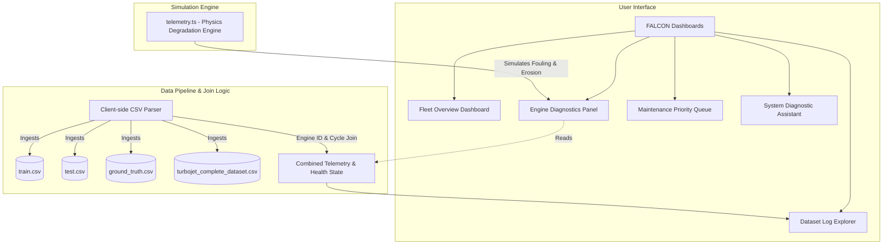
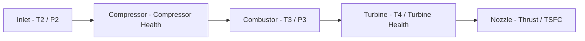

# FALCON: Four-Stage Aeroengine Latent Component & Operational Network
### Built for Aerothon 2026 (IIT Indore in collaboration with Hindustan Aeronautics Limited)

FALCON is a high-fidelity decision-support cockpit and predictive maintenance interface for aeroengines. It serves as a physics-informed digital twin platform, enabling real-time telemetry tracking, degradation simulation, dataset exploration, and prioritized maintenance scheduling for five operational turbojet engines.

---

## Executive Summary

Modern aerospace gas turbines operate under extreme thermal and mechanical stresses. Over their operational lifespan, components degrade due to mechanical wear, compressor fouling, and turbine erosion. FALCON addresses this by mapping high-dimensional sensor data to latent component health states, allowing engineers to visualize telemetry streams, run predictive diagnostic queries, and schedule maintenance prior to critical component failure.

---

## System Architecture

The application is structured as a client-side digital twin dashboard, decoupling real-time diagnostic rendering from static data pipelines. 



---

## Aeroengine Flow State & Sensor Layout

The simulated four-stage turbojet engine models thermodynamic changes across key stations. Telemetry parameters represent actual physical readings from these stations:



### Sensor Telemetry Mappings
* Altitude: Flight altitude in meters.
* Mach: Mach number.
* Tamb: Ambient temperature in Kelvin.
* Pamb: Ambient pressure in Pascals.
* RPM: Engine core rotational speed in revolutions per minute.
* FuelFlow: Fuel flow rate in kilograms per second.
* T2: Compressor inlet temperature in Kelvin.
* P2: Compressor inlet pressure in Pascals.
* T3: Combustor inlet temperature in Kelvin.
* P3: Combustor inlet pressure in Pascals.
* T4: Turbine exit temperature in Kelvin.
* P4: Turbine exit pressure in Pascals.

---

## Core Platform Modules

### 1. Fleet Overview Dashboard
Provides a centralized status view of all operational engines in the fleet. Displays:
* Overall active engine status (Normal, Caution, Danger).
* Real-time telemetry widgets.
* Dynamic Remaining Useful Life (RUL) bar gauges.
* Real-time alarm signals (e.g. exhaust gas temperature anomalies, compressor surge limits).

### 2. Subsystem Diagnostic Panel
An interactive diagnostics bay where engineers can:
* Inspect individual component degradation trends.
* Toggle active simulation controls to test the digital twin under degradation scenarios:
  * Compressor Fouling: Decreases compressor efficiency, leading to higher fuel consumption and reduced pressure ratios.
  * Turbine Erosion: Promotes thermal stress and lowers turbine blade effectiveness, leading to exhaust temperature spikes.
* Track parameters like compressor discharge pressure, turbine inlet temperature, and thrust margins in real time.

### 3. Dataset Log Explorer
A database client for analyzing official engineering datasets. It includes:
* Selector for Training Sets, Testing Sets, and Consolidated Logs.
* Stored Engineering Datasets Drawer: Offers direct download links for the four source CSV files (`train.csv`, `test.csv`, `ground_truth.csv`, and `turbojet_complete_dataset.csv`) alongside a live top-5 record preview table.
* Dual-Axis Line Charts: Supports plotting any two telemetry parameters simultaneously against time-series cycles to identify correlations.
* Custom Ingestion Zone: Drag-and-drop file uploader that parses custom telemetry logs in CSV format and updates the active environment instantly.

### 4. Maintenance Priority Queue
An automated maintenance board that ranks engine repair actions based on combined health indexes. The priority formula aggregates:
* Operating Cycle Count: Number of cycles logged.
* Remaining Useful Life (RUL): Predicted cycles left before failure.
* Confidence Index: Analytical model certainty.
* Urgency Tagging: Categorizes tasks into Immediate, Scheduled, or Routine.

### 5. System Diagnostic Assistant
A context-aware technical chatbot. It loads the active telemetry values of the selected engine into its memory buffer, providing engineers with:
* Instant troubleshooting guides.
* Mission clearance verification (Dispatch/No-Go).
* Recommended repair workflows.

---

## Dataset Joining Pipeline

When exploring pre-packaged logs, the application parses the data in-memory:
* Flight logs (`train.csv` or `test.csv`) contain raw telemetry records.
* Ground truth logs (`ground_truth.csv`) contain calculated health status coefficients (such as `CompressorHealth` and `TurbineHealth`) and engine performance metrics (`Thrust_N` and `TSFC_g_N_s`).
* The joining function combines these logs using `EngineID` and `Cycle` as composite keys:

```
CombinedRecord = {
  ...TelemetryData[EngineID][Cycle],
  ...GroundTruthData[EngineID][Cycle]
}
```

If the pre-joined `turbojet_complete_dataset.csv` is selected, the parser bypasses this join step and loads the integrated records directly for increased performance.

---

## Local Development and Deployment

### Installation

FALCON is built using React, Vite, TypeScript, and Vanilla CSS. To run it locally:

1. Clone the repository to your local directory.
2. Install the package dependencies using npm or bun:
```bash
npm install
# or
bun install
```

### Running Locally

Start the local Vite development server:
```bash
npm run dev
# or
bun dev
```
Open your browser and navigate to the local address (typically http://localhost:3000 or http://localhost:5173).

### Production Build & Deployment

To compile the production assets:
```bash
npm run build
# or
bun build
```

The application is configured to deploy directly on Vercel. SPA rewriting rules are declared in `vercel.json` to ensure client-side routing functions correctly while keeping the public assets directory accessible:

```json
{
  "rewrites": [
    { "source": "/Datasets/(.*)", "destination": "/Datasets/$1" },
    { "source": "/(.*)", "destination": "/index.html" }
  ]
}
```

---

## Styling and Design Philosophy

FALCON utilizes a custom light HUD design system implemented in `src/styles.css` with Tailwind CSS integration:
* Canvas Background: Deep Space Navy (`#1e2d4a` / `#121b2d`) for high visual contrast and modern commanding aesthetics.
* Instruments & Panels: Premium Cool Ice-Blue (`#f0f4f8` / `#e1e9f2`) that offers a clean, professional, and tactile visual appearance.
* Typography: JetBrains Mono and Space Mono for labels, tables, and telemetry values to provide a clean mathematical layout, paired with Inter for general text.
* Micro-Animations: Subtle transition speeds and opacity fades highlight status changes without introducing distraction.
