# FALCON: Four-Stage Aeroengine Latent Component & Operational Network
### Aerothon 2026 — IIT Indore x Hindustan Aeronautics Limited (HAL)
**Problem Statement 2**: Physics-Informed Digital Twin for Real-Time Four-Stage Turbojet Health Monitoring  
**Team Name**: Avyay  
**Team Lead**: Manasvi Gangrade (gangrademanasvi@gmail.com)  
**Team Members**: Muskan Lodhi, Suhani Sharma  

---

## Executive Overview

FALCON (Four-Stage Aeroengine Latent Component & Operational Network) is a defense-grade decision-support framework and physics-informed digital twin designed for real-time aeroengine health assessment, predictive maintenance, and mission readiness verification. Built specifically for single-spool four-stage turbojet engines (such as the HAL Adour Mk 811 / TJ-04 series), FALCON bridges raw 14-channel sensor telemetry with thermodynamic first-principles laws, physics-informed neural network (PINN) loss functions, and causal failure knowledge graphs.

The primary objective of the platform is to solve the aeroengine health estimation problem: *"From sensor readings to engineering insight: estimating what cannot be measured directly, and explaining why."*

---

## Open-Source Research Publications & Technical References

The theoretical foundations, thermodynamic derivations, PINN loss formulations, and underlying mathematical models of the FALCON framework are published and open-sourced on ResearchGate:

| # | Research Publication Title | Primary Technical Domain | ResearchGate Open-Access Link |
| :-: | :--- | :--- | :--- |
| **1** | **FALCON: A Physics-Informed Digital Twin Framework for Explainable Health Assessment and Predictive Maintenance of Four-Stage Turbojet Engines** | System Architecture, PINN Methodology & Decision-Support Framework | [View Publication on ResearchGate](https://www.researchgate.net/publication/411680808_FALCON_A_Physics-Informed_Digital_Twin_Framework_for_Explainable_Health_Assessment_and_Predictive_Maintenance_of_Four-Stage_Turbojet_Engines) |
| **2** | **Physics-Informed Formulation and Governing Equations of the FALCON Digital Twin Framework** | PINN Physics Residual Formulations & Multi-Objective Loss Functions | [View Publication on ResearchGate](https://www.researchgate.net/publication/411706336_Physics-Informed_Formulation_and_Governing_Equations_of_the_FALCON_Digital_Twin_Framework) |
| **3** | **FALCON: Physics, Mathematics & Engineering Equations Reference** *(Companion Technical Spec)* | Full Mathematical Derivations of all 18 Governing Equations & Thermodynamic Laws | [View Publication on ResearchGate](https://www.researchgate.net/publication/411705948_FALCON_Physics_Mathematics_Reference) |

---

## System Architecture Diagram

```mermaid
flowchart TD
    %% Styling Classes with High-Contrast Colors
    classDef inputLayer fill:#0f172a,stroke:#38bdf8,stroke-width:2px,color:#f8fafc;
    classDef physicsEngine fill:#1e1b4b,stroke:#a855f7,stroke-width:2px,color:#f3e8ff;
    classDef pinnLayer fill:#064e3b,stroke:#34d399,stroke-width:2px,color:#ecfdf5;
    classDef graphLayer fill:#701a75,stroke:#f0abfc,stroke-width:2px,color:#fdf4ff;
    classDef uiLayer fill:#1e293b,stroke:#0284c7,stroke-width:2px,color:#f0f9ff;
    classDef exportLayer fill:#78350f,stroke:#fbbf24,stroke-width:2px,color:#fffbeb;

    subgraph Data [14-Channel Sensor Telemetry Stream]
        S1[Station 2.0: P2, T2, Altitude, Mach]:::inputLayer
        S2[Station 3.0: P3, T3, Fuel Flow, RPM]:::inputLayer
        S3[Station 4.0 & 5.0: P4, T4, Thrust, TSFC]:::inputLayer
    end

    subgraph Core [Physics & Thermodynamic Engine - falcon_physics_core.py]
        P1[Brayton Cycle Isentropic Evaluation]:::physicsEngine
        P2[Shaft Power Balance: W_t * eta_m = W_c]:::physicsEngine
        P3[Subsystem Efficiencies: eta_c, eta_t]:::physicsEngine
    end

    subgraph PINN [Physics-Informed Neural Network - pinn_model.py]
        N1[Data Loss: MSE Telemetry]:::pinnLayer
        N2[Physics Residual Loss: Power Balance]:::pinnLayer
        N3[Monotonic Degradation Loss]:::pinnLayer
        N4[Composite PINN Loss Formulation]:::pinnLayer
    end

    subgraph Causal [Causal Reasoning & Diagnostics - knowledge_graph.py]
        K1[Bayesian Knowledge Graph Node Traversal]:::graphLayer
        K2[Subsystem Root Fault Isolation]:::graphLayer
        K3[Level-2 Maintenance Action Dispatch]:::graphLayer
    end

    subgraph UI [Operational Dashboard & Visualization Layer]
        U1[Fleet Overview & Sector IV Radar]:::uiLayer
        U2[What-If Anomaly Simulator]:::uiLayer
        U3[Dataset Explorer & Dual-Axis Plotting]:::uiLayer
        U4[Interactive 18-Equation Physics Spec]:::uiLayer
    end

    subgraph Output [Executive Outputs & Evaluation]
        O1[Overall Engine Health % Prediction]:::exportLayer
        O2[Remaining Useful Life RUL Cycles]:::exportLayer
        O3[MIL-STD Executive HAL PDF Report]:::exportLayer
        O4[Test Set Runner: evaluate_test_set.py]:::exportLayer
    end

    Data --> Core
    Core --> PINN
    PINN --> Causal
    Causal --> UI
    UI --> Output
```



---

## Aeroengine Station Flow & Sensor Telemetry Mapping

The single-spool four-stage turbojet engine operates across 5 key thermodynamic stations.

```mermaid
flowchart LR
    %% Styling Classes
    classDef st1 fill:#1e3a8a,stroke:#60a5fa,stroke-width:2px,color:#ffffff;
    classDef st2 fill:#065f46,stroke:#34d399,stroke-width:2px,color:#ffffff;
    classDef st3 fill:#991b1b,stroke:#f87171,stroke-width:2px,color:#ffffff;
    classDef st4 fill:#7c2d12,stroke:#fb923c,stroke-width:2px,color:#ffffff;
    classDef st5 fill:#4c1d95,stroke:#c084fc,stroke-width:2px,color:#ffffff;

    ST1["Station 2.0<br>Air Intake & Fan Inlet"]:::st1
    ST2["Station 2.5<br>Compressor Stage"]:::st2
    ST3["Station 3.0<br>Combustion Chamber"]:::st3
    ST4["Station 4.0<br>High-Pressure Turbine"]:::st4
    ST5["Station 5.0<br>Exhaust Nozzle"]:::st5

    ST1 -->|Cold Compressed Air| ST2
    ST2 -->|High Pressure Air P3, T3| ST3
    ST3 -->|High Temp Fuel Gas T4| ST4
    ST4 -->|Expanded Gas Velocity V_e| ST5
```



### Table 1: Station Sensor Telemetry Specifications

| Station ID | Station Name | Primary Telemetry Parameters | Physics Parameter Symbol | Sensor Range / Nominal Units |
| :--- | :--- | :--- | :--- | :--- |
| **Station 2.0** | Air Inlet & Fan Entry | Ambient Pressure, Temperature, Altitude, Mach | P_amb, T_amb, Alt, Mach | 30.0 to 101.3 kPa, 220 to 300 K |
| **Station 2.5** | Compressor Discharge | Compressor Inlet Pressure & Temperature | P2, T2 | 45.0 to 95.0 kPa, 380 to 520 K |
| **Station 3.0** | Combustor Inlet / Exit | Combustor Pressure, Temperature, Fuel Flow, RPM | P3, T3, FuelFlow, RPM | 40.0 to 85.0 kPa, 950 to 1350 K, 8000 to 14000 RPM |
| **Station 4.0** | HPT Turbine Exit | Turbine Exit Pressure & Exit Temperature | P4, T4 | 18.0 to 45.0 kPa, 750 to 1050 K |
| **Station 5.0** | Exhaust Nozzle | Gross Uninstalled Thrust, TSFC | F_net, TSFC | 10.0 to 35.0 kN, 0.45 to 1.25 kg/(kN h) |

---

## Comprehensive Physics & Mathematical Formulation

### 1. Thermodynamic Brayton Cycle & Isentropic Efficiencies

The single-spool turbojet thermodynamic cycle relies on key isentropic relations across the compressor and turbine stages:

```
Eq 1.1: Overall Compressor Pressure Ratio
pi_c = P2 / P_amb

Eq 2.1: Isentropic Compressor Discharge Temperature
T2s = T_amb * (pi_c)^((gamma - 1) / gamma)

Eq 3.1: Compressor Isentropic Efficiency
eta_c = (T2s - T_amb) / (T2_actual - T_amb)

Eq 6.1: High-Pressure Turbine Expansion Ratio
pi_t = P3 / P4

Eq 7.1: Isentropic Turbine Exit Temperature
T4s = T3_actual / ((pi_t)^((gamma_gas - 1) / gamma_gas))

Eq 8.1: Turbine Isentropic Efficiency
eta_t = (T3_actual - T4_actual) / (T3_actual - T4s)
```

### 2. Mechanical Shaft Power Balance & PINN Loss Function

For a single-spool aeroengine, mechanical energy conservation dictates that turbine shaft power produced minus mechanical transmission losses must equal the compressor power absorbed:

```
Eq 4.1: Compressor Power Absorbed (kW)
W_c = m_dot_a * Cp_a * (T2_actual - T_amb)

Eq 9.1: Turbine Power Produced (kW)
W_t = (m_dot_a + m_dot_f) * Cp_g * (T3_actual - T4_actual)

Eq 10.1: Mechanical Power Balance Residual (kW)
Residual_power = (W_t * eta_m) - W_c

Eq 11.1: PINN Power Loss Residual
Loss_power = |W_t * eta_m - W_c|^2
```

### 3. Physics-Informed Neural Network (PINN) Composite Loss

To enforce physical laws during neural network training and inference, FALCON formulates a composite loss function combining empirical data fit with physical penalty terms:

```
Eq 15.1: Composite Loss Function
Loss_composite = w_data * Loss_data + w_power * Loss_power + w_eff * Loss_eff + w_mon * Loss_mon

Where:
- Loss_data  = Mean Squared Error between telemetry sensor observations and model outputs.
- Loss_power = Squared violation of single-spool shaft mechanical power balance.
- Loss_eff   = Isentropic efficiency boundary violation loss (0.0 <= eta <= 1.0).
- Loss_mon   = Monotonicity loss enforcing non-increasing component health trends without repair.
- Weights    = (w_data=1.0, w_power=0.15, w_eff=0.10, w_mon=0.05).
```

### Table 2: Master 18 Governing Equations Reference Table

| Eq ID | Equation Name | Mathematical Expression | Physical Law / Principle | Proposal Ref |
| :---: | :--- | :--- | :--- | :---: |
| **Eq 1.1** | Compressor Pressure Ratio | `pi_c = P2 / P_amb` | Aerodynamic Compression Ratio | Section 5 |
| **Eq 2.1** | Isentropic Compressor Temp | `T2s = T_amb * (pi_c)^((gamma-1)/gamma)` | Isentropic State Relation | Section 5 |
| **Eq 3.1** | Compressor Efficiency | `eta_c = (T2s - T_amb) / (T2 - T_amb)` | First & Second Law Thermodynamics | Section 8 |
| **Eq 4.1** | Compressor Power Absorbed | `W_c = m_dot_a * Cp_a * (T2 - T_amb)` | Conservation of Energy | Section 8 |
| **Eq 5.1** | Combustor Energy Balance | `Q_res = \|m_dot_f*LHV*eta_b - m_dot_g*Cp_g*T3 + m_dot_a*Cp_a*T2\|` | Combustor First Law Balance | Section 8 |
| **Eq 6.1** | Turbine Expansion Ratio | `pi_t = P3 / P4` | Aerodynamic Expansion Ratio | Section 5 |
| **Eq 7.1** | Isentropic Turbine Temp | `T4s = T3 / (pi_t)^((gamma-1)/gamma)` | Isentropic Expansion Relation | Section 8 |
| **Eq 8.1** | Turbine Efficiency | `eta_t = (T3 - T4) / (T3 - T4s)` | Turbine Isentropic Efficiency | Section 8 |
| **Eq 9.1** | Turbine Power Produced | `W_t = m_dot_g * Cp_g * (T3 - T4)` | Turbine Mechanical Output | Section 8 |
| **Eq 10.1** | Shaft Power Balance | `Residual = W_t * eta_m - W_c` | Single-Spool Mechanical Balance | Section 9 |
| **Eq 11.1** | PINN Power Residual Loss | `Loss_power = (W_t * eta_m - W_c)^2` | Physics Penalty Term | Section 9 |
| **Eq 12.1** | Nozzle Exhaust Velocity | `V_e = sqrt(2*Cp_g*T4*(1 - (P_amb/P4)^((gamma-1)/gamma)))` | Saint-Venant Exhaust Velocity | Section 8 |
| **Eq 13.1** | Net Aeroengine Thrust | `F_net = (m_dot_g * V_e) - (m_dot_a * V_a)` | Momentum Rate Balance | Section 8 |
| **Eq 14.1** | Thrust-Specific Fuel Cons. | `TSFC = m_dot_f / F_net` | Engine Fuel Efficiency Index | Section 8 |
| **Eq 15.1** | PINN Composite Loss | `Loss = w_d*L_d + w_p*L_p + w_e*L_e + w_m*L_m` | Multi-Objective Physics Regularization | Section 9 |
| **Eq 16.1** | Subsystem Health Indices | `Comp, Comb, Turb Health Mapping` | Multi-Subsystem Degradation Model | Section 8 |
| **Eq 17.1** | Overall Engine Health % | `Overall_Health = 0.40*Comp + 0.25*Comb + 0.35*Turb` | Aerothon PS2 Target Capability % | Section 8 |
| **Eq 18.1** | Remaining Useful Life RUL | `RUL_cycles = f(Overall_Health_Percent)` | Piecewise RUL Prognostics | Section 10 |

---

## Subsystem Health & Health Status Categorization Matrix

### Table 3: Health Status Classification Matrix (Aerothon PS2 Target)

| Health Range (%) | Health Status Tag | Color Code | System Condition | Required Maintenance Action |
| :---: | :---: | :---: | :--- | :--- |
| **85.0% to 100.0%** | **NOMINAL** | Emerald Green | Optimal baseline health. All parameters within specification. | Clear for flight operations. Routine 100-hour inspection. |
| **70.0% to 84.9%** | **WATCH** | Cyan / Sky Blue | Mild efficiency drop detected in compressor or turbine. | Monitor trend. Schedule inspection within 50 flight cycles. |
| **50.0% to 69.9%** | **WARNING** | Amber / Yellow | Moderate degradation. Thermal stress elevation logged at T4. | Level-2 Shop Maintenance. Replace damaged turbine blades. |
| **0.0% to 49.9%** | **CRITICAL** | Crimson Red | Severe degradation or surge risk detected. | Immediate AOG (Aircraft On Ground) lockout. Engine overhaul. |

---

## Comprehensive Repository File Breakdown

### Table 4: Project File Directory and Technical Purpose

| File Path | Technology Layer | Primary Functional Purpose |
| :--- | :--- | :--- |
| **`backend/falcon_physics_core.py`** | Python 3 / NumPy / PyTorch | Single source of truth containing all 18 Master Governing Equations, Brayton thermodynamics, and health percentage calculation functions. |
| **`backend/evaluate_test_set.py`** | Python 3 / Pandas / Benchmarking | Official competition test set runner for judges. Evaluates unseen CSVs, prints accuracy, latency (ms), RAM usage (MB), and exports predictions CSV. |
| **`backend/pinn_model.py`** | PyTorch / PINN Architecture | Physics-Informed Neural Network neural model enforcing physical shaft power balance losses. |
| **`backend/knowledge_graph.py`** | Python 3 / Causal Graphs | Bayesian Causal Knowledge Graph mapping telemetry anomalies to subsystem root causes and maintenance dispatches. |
| **`backend/dataset_loader.py`** | Python 3 / Pandas | Ingestion, feature engineering, and normalization for historical and real-time telemetry CSVs. |
| **`backend/main.py`** | Python 3 / FastAPI / WebSockets | Production REST API and WebSocket streaming server (Port 8000). |
| **`src/components/falcon/FalconApp.tsx`** | React / TypeScript / SPA | Main application container coordinating state, active engine selection, and multi-tab page routing. |
| **`src/components/falcon/TopBar.tsx`** | React / Tailwind CSS | Solid high-contrast header bar containing API badge, pitch modal trigger, PDF exporter, and engine dropdown. |
| **`src/components/falcon/pages/FleetOverview.tsx`** | React / Recharts | Central fleet status dashboard with airspace radar integration and dynamic health bars. |
| **`src/components/falcon/pages/EngineDetail.tsx`** | React / Recharts | Single-engine 14-channel telemetry monitoring panel deconstructed by engine station. |
| **`src/components/falcon/pages/RadarFleetMap.tsx`** | React / HTML Canvas | Real-time Sector IV airspace radar visualizing live aircraft positioning and health severities. |
| **`src/components/falcon/pages/ReasoningGraph.tsx`** | React / SVG Visualizer | Causal knowledge graph node renderer illustrating anomaly propagation paths. |
| **`src/components/falcon/pages/WhatIfSimulator.tsx`** | React / Interactive Controls | Fault injection simulator allowing users to tweak compressor fouling and turbine erosion to observe predicted RUL. |
| **`src/components/falcon/pages/PhysicsReference.tsx`** | React / MathJax / Sliders | Interactive 18-equation specification page with live thermodynamic slider evaluation. |
| **`src/components/falcon/pages/DatasetExplorer.tsx`** | React / Recharts / File API | Data log explorer with direct CSV download links, dual-axis telemetry correlation plots, and custom CSV uploader. |
| **`src/components/falcon/pages/AiAssistant.tsx`** | React / AI Integration | Technical chatbot loaded with live telemetry memory buffer for diagnostic Q&A. |
| **`src/components/falcon/pages/PriorityBoard.tsx`** | React / UI Components | Automated maintenance priority queue ranking engines by operational risk and RUL. |
| **`src/lib/telemetry.ts`** | TypeScript | High-frequency (1Hz) client-side telemetry simulator and station thermodynamics evaluator. |
| **`src/lib/audio-effects.ts`** | Web Audio API | Synthesizer generating tactical HUD audio feedback for step events and alert alarms. |
| **`src/lib/pdf-export.ts`** | jsPDF / AutoTable | Client-side PDF generator producing MIL-STD compliant executive HAL maintenance authorization reports. |

---

## Instructions for Competition Judges (Evaluation Script)

To evaluate the FALCON model against an unseen competition test set:

1. Open a command line interface in the project root directory.
2. Run the official benchmark evaluation script:
```bash
python backend/evaluate_test_set.py --input Datasets/ground_truth.csv --output backend/predictions_output.csv
```
3. The script will automatically execute and display:
   - Total test records processed
   - Fleet Average Overall Engine Health (%)
   - PINN Shaft Power Residual Error (kW)
   - Total execution duration and inference latency per sample (ms/sample)
   - Peak RAM memory consumption (MB)
   - Generated predictions saved to `backend/predictions_output.csv`.

---

## Local Installation and Execution Guide

### Prerequisites
- Node.js (v18.0 or higher)
- Python (v3.9 or higher)

### 1. Frontend Development Server

Install frontend dependencies:
```bash
npm install
```

Launch the Vite development environment:
```bash
npm run dev
```
Open browser at `http://localhost:8080` or `http://localhost:5173`.

### 2. Backend FastAPI Physics Server

Navigate to backend directory:
```bash
cd backend
```

Install backend dependencies:
```bash
pip install -r requirements.txt
```

Launch FastAPI server:
```bash
python main.py
```
OpenAPI interactive Swagger documentation is available at `http://127.0.0.1:8000/docs`.

---

## Conclusion & Submission Summary

The FALCON Digital Twin platform provides a complete, explainable, and mathematically verified decision-support system for HAL aeroengine maintenance teams. By embedding thermodynamic first principles into neural network loss functions, FALCON ensures mission-critical health predictions that are robust against sensor noise, telemetry dropouts, and non-linear operational environments.
